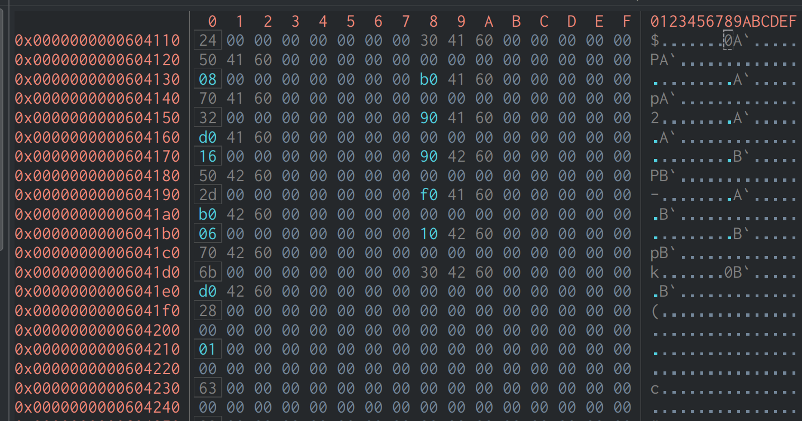

# 北邮 计算机系统基础 实验二 二进制逆向拆炸弹 题解

## 题目要求

给出一个二进制可执行文件（ELF），其逻辑含**多个**阶段，每个阶段需输入一个字符串（密码/答案），只有输入的字符串服从某些条件，才能进入下一阶段并获得分数；否则，若输入的字符串不符，则炸弹“爆炸”，扣除部分分数。要求通过逆向工程“破解”所有阶段。

## 分析方法

理论上，可以采用动态调试的方较为轻松地获得答案，甚至通过控制指令执行在答案未知的情况下“伪造发送”成功的请求并获得分数。但，出于提高对汇编指令的理解是目的，本文将全部采用静态分析。

## 分析工具

本文采用`Cutter`作为逆向工具，同时使用`Ghidra decompiler`作为反编译工具生成伪 C 代码。尽管可由反编译工具自动生成伪 C 代码，后文仍会分析如何手动从汇编指令“还原”C 代码，同时化简工具生成的伪 C 代码并修正其中的一些错误。

## 样本

由于在实验中，对于每个学生分配了独一无二的“炸弹”，由该二进制文件可直接对应到学号等信息，故此处暂不公开二进制文件样本。

不过，本题解及所有参考等效 C 代码、关键汇编指令可在[该 GitHub 仓库](https://github.com/saitewasreset/BUPT_CSAPP_Lab2-Defuse_Bomb)中找到。

## Phase 1

答案：

```text
In 2004, BUPT became one of the 56 universities which have graduate school.
```

伪 C 代码：

```c
void phase_1(int64_t arg1)
{
    int32_t iVar1;

    iVar1 = strings_not_equal(arg1, 0x402660);
    if (iVar1 != 0) {
        explode_bomb();
    }
    return;
}
```

非常善良的是，作者并未删除全部的调试符号，从`strings_not_equal`函数名即可看出应当是比较输入的字符串是否等于`0x402660`地址处的字符串。

根据程序段信息：

```text
$ readelf -S bomb
There are 37 section headers, starting at offset 0x7068:

Section Headers:
  [Nr] Name              Type             Address           Offset
       Size              EntSize          Flags  Link  Info  Align
  ...
  [14] .text             PROGBITS         0000000000400d00  00000d00
       0000000000001802  0000000000000000  AX       0     0     16
  [15] .fini             PROGBITS         0000000000402504  00002504
       0000000000000009  0000000000000000  AX       0     0     4
  [16] .rodata           PROGBITS         0000000000402510  00002510
       00000000000005e6  0000000000000000   A       0     0     16
  [17] .eh_frame_hdr     PROGBITS         0000000000402af8  00002af8
       0000000000000114  0000000000000000   A       0     0     4
  ...
Key to Flags:
  W (write), A (alloc), X (execute), M (merge), S (strings), I (info),
  L (link order), O (extra OS processing required), G (group), T (TLS),
  C (compressed), x (unknown), o (OS specific), E (exclude),
  D (mbind), l (large), p (processor specific)

```

该虚拟内存地址范围位于`.rodata`段中，由二进制文件中相应位置的内容映射而来，故可直接在二进制文件中的对应部分找到其内容。

在`Cutter`中跳转到该地址，不难找到第一题的答案。


或者，也可以使用`objdump`工具查看该处的内容：

```text
$ objdump -s --section=.rodata bomb

bomb:     file format elf64-x86-64

Contents of section .rodata:
 ...
 402650 79207468 6973206f 6e652e00 00000000  y this one......
 402660 496e2032 3030342c 20425550 54206265  In 2004, BUPT be
 402670 63616d65 206f6e65 206f6620 74686520  came one of the
 402680 35362075 6e697665 72736974 69657320  56 universities
 402690 77686963 68206861 76652067 72616475  which have gradu
 4026a0 61746520 7363686f 6f6c2e00 00000000  ate school......
 4026b0 576f7721 20596f75 27766520 64656675  Wow! You've defu
 4026c0 73656420 74686520 73656372 65742073  sed the secret s
 ...

```

在之后的分析中，将省略如何读取程序虚拟地址空间中某地址处内容的叙述，直接给出相应内容。

### 详细分析

#### phase_1 函数

首先，我们从`phase_1`函数的汇编代码出发，分析反编译工具是如何得到上述伪 C 代码的。

```asm
phase_1(int64_t arg1);
; arg int64_t arg1 @ rdi
0x00400f2d      sub     rsp, 8
0x00400f31      mov     esi, str.In_2004__BUPT_became_one_of_the_56_universities_which_have_graduate_school. ; 0x402660
0x00400f36      call    strings_not_equal ; sym.strings_not_equal
0x00400f3b      test    eax, eax
0x00400f3d      je      0x400f44
0x00400f3f      call    explode_bomb ; sym.explode_bomb
0x00400f44      add     rsp, 8
0x00400f48      ret
```

注意在 x86_64 调用约定中，调用函数时，第一个参数放在`rdi`中，第二个参数放在`rsi`中。

`0x00400f2d`及`0x00400f44`的指令分别分配、释放了本函数使用的栈空间，但在本函数中并无用处。

`0x00400f31`处的`mov`指令将`0x402660`存入了`esi`中，显然，该地址将作为第二个参数传递给`strings_not_equal`函数。

在`0x00400f36`处调用`strings_not_equal`函数前，并未修改`rdi`寄存器的值，因此，传递给`strings_not_equal`函数的第一个参数与传递给`phase_1`的相同。

结合提供的`bomb.c`文件及`strings_not_equal`这一函数名，不难得到`strings_not_equal`函数的部分原型（目前，还未分析返回值的类型）：

`? string_not_equal(char *a, char *b)`

由此，到`0x00400f36`处的汇编可翻译为如下 C 代码（其中，`?`表示尚未分析的类型）：

```c
? phase_1(char *input) {
    ? ret = string_not_equal(input, (char *)0x402660);

    ...
}
```

接下来的

```asm
0x00400f3b      test    eax, eax
0x00400f3d      je      0x400f44
0x00400f3f      call    explode_bomb ; sym.explode_bomb
0x00400f44      .......
```

是标准的`if`结构

注意在 x86_64 调用约定中，函数的返回值存储在`rax/eax`寄存器中

`test`指令将两个操作数进行与运算，并设置相应标志位。

`je`指令根据标志位中的`ZF`决定是否跳转：若`ZF = 1`，则跳转；若`ZF = 0`，则不跳转。

`0x00400f3b`处的`test`指令的两个操作数相同，显然，只有`eax = 0`时，才有`ZF = 0`。

因此

```asm
0x00400f3b      test    eax, eax
0x00400f3d      je      0x400f44
```

可翻译为：若`strings_not_equal`的返回值为 0，则跳转到`0x00400f44`处，也即，跳过该`if`语句块内的内容。

由此可推断出，要执行`if`语句块内的代码，`strings_not_equal`的返回值应不等于 0，由此可得到如下 C 代码（注意，由于还未分析`explode_bomb`函数中的内容，我们不能直接得到其参数列表）：

```c
if (ret != 0) {
    explode_bomb(?...);
}
```

由此还可推断出，`strings_not_equal`返回的应当是布尔值（在 C 中，可以使用`int`表示）

结合上述分析，可以得到`phase_1`的等效 C 代码：

其中：

- `phase_1`函数的返回值为`void`可由分析`main`函数或查看提供的`bomb.c`得知；
- `explode_bomb`函数的参数列表为空可由分析`explode_bomb`函数得到，此处留作习题。

```c
void phase_1(char *input) {
    int ret = string_not_equal(input, (char *)0x402660);
    if (ret != 0) {
        explode_bomb();
    }
}
```

#### string_not_equal 函数

`string_not_equal`函数的伪 C 代码如下：

```c
undefined8 strings_not_equal(int64_t arg1, int64_t arg2)
{
    int32_t iVar1;
    int32_t iVar2;
    undefined8 uVar3;

    iVar1 = string_length(arg1);
    iVar2 = string_length(arg2);
    uVar3 = 1;
    if (iVar1 == iVar2) {
        if (*(char *)arg1 == '\0') {
            uVar3 = 0;
        } else if (*(char *)arg1 == *(char *)arg2) {
            do {
                arg1 = arg1 + 1;
                arg2 = arg2 + 1;
                if (*(char *)arg1 == '\0') {
                    return 0;
                }
            } while (*(char *)arg1 == *(char *)arg2);
            uVar3 = 1;
        } else {
            uVar3 = 1;
        }
    }
    return uVar3;
}
```

其中调用了`string_length`函数，该函数逻辑比较简单，故此处不展开。

从伪 C 代码中，很容易看出该函数的逻辑：若字符串长度不相等，直接返回`true`；否则，逐个字符地比较这两个字符串直到`\0`，若有字符不相同，返回`true`，否则，返回`false`。

下面从汇编指令角度分析：

```asm
strings_not_equal(char* arg1, char* arg2);
; arg char* arg1 @ rdi
; arg char* arg2 @ rsi
0x004013bb      push    r12
0x004013bd      push    rbp
0x004013be      push    rbx
0x004013bf      mov     rbx, rdi   ; arg1
0x004013c2      mov     rbp, rsi   ; arg2
0x004013c5      call    string_length ; sym.string_length
0x004013ca      mov     r12d, eax
0x004013cd      mov     rdi, rbp
0x004013d0      call    string_length ; sym.string_length
0x004013d5      mov     edx, 1
0x004013da      cmp     r12d, eax
0x004013dd      jne     0x40141b
0x004013df      movzx   eax, byte [rbx]
0x004013e2      test    al, al
0x004013e4      je      0x401408
0x004013e6      cmp     al, byte [rbp]
0x004013e9      je      0x4013f2
0x004013eb      jmp     0x40140f
0x004013ed      cmp     al, byte [rbp]
0x004013f0      jne     0x401416
0x004013f2      add     rbx, 1
0x004013f6      add     rbp, 1
0x004013fa      movzx   eax, byte [rbx]
0x004013fd      test    al, al
0x004013ff      jne     0x4013ed
0x00401401      mov     edx, 0
0x00401406      jmp     0x40141b
0x00401408      mov     edx, 0
0x0040140d      jmp     0x40141b
0x0040140f      mov     edx, 1
0x00401414      jmp     0x40141b
0x00401416      mov     edx, 1
0x0040141b      mov     eax, edx
0x0040141d      pop     rbx
0x0040141e      pop     rbp
0x0040141f      pop     r12
0x00401421      ret
```

从`uVar3 = 1;`，即`0x004013d5`处开始分析。

注意第一次调用`string_length`返回的结果被存储在了`r12`中，第二次调用的结果仍在`rax`中。

`0x004013da`处的`cmp`指令使用减法运算比较了`r12d`和`eax`，并设置相应标志位。

`0x004013dd`处的`jne`指令在`ZF = 0`时跳转。依照上面提到过的分析`if`语句的方法，可以得到：

```c
int string_not_equal(const char *a, const char *b) {
    int ret = 1;
    if (string_length(a) == string_length(b)) {
        ...
    }

    return ret;
}

```

在本函数开始时（`0x004013bf`、`0x004013c2`），将参数`char *a, char *b`的值分别赋给了`rbx、rbp`，即：

```c
char *cur_a = a;
char *cur_b = b;
```

接下来又进行了一次`if`判断：若`*cur_a = '\0'`，则直接返回`false`（见`0x401408`处的指令）

```asm
0x004013df      movzx   eax, byte [rbx]
0x004013e2      test    al, al
0x004013e4      je      0x401408
```

```c
if (*cur_a == '\0') {
    return 0;
}

```

接下来判断了`*cur_a`是否等于`*cur_b`（注意`al`中为上一步得到的`*cur_a`的值）：若不等于，直接返回`true`（见`0x40140f`处的指令）

```asm
0x004013e6      cmp     al, byte [rbp]
0x004013e9      je      0x4013f2
0x004013eb      jmp     0x40140f
```

接下来可注意到如下循环结构（判断+前向跳转）：

```asm
0x004013ed      cmp     al, byte [rbp]
0x004013f0      jne     0x401416
0x004013f2      add     rbx, 1
0x004013f6      add     rbp, 1
0x004013fa      movzx   eax, byte [rbx]
0x004013fd      test    al, al
0x004013ff      jne     0x4013ed
```

在每次循环中，先获取`*cur_b`的值，并将其与`al`比较，若不相等，则直接返回`true`（见`0x401416`处的指令）。

之后，将`rbx`与`rbp` + 1

```c
cur_a ++;
cur_b ++;
```

直到`*cur_a`的值为`\0`时，循环结束。

其实，不难发现，“判断了`*cur_a`是否等于`*cur_b`”是用于确定是否第一次进入循环的，而将其与后面的循环结构合并：

```asm
0x004013e6      cmp     al, byte [rbp]
0x004013e9      je      0x4013f2
0x004013eb      jmp     0x40140f
0x004013ed      cmp     al, byte [rbp]
0x004013f0      jne     0x401416
0x004013f2      add     rbx, 1
0x004013f6      add     rbp, 1
0x004013fa      movzx   eax, byte [rbx]
0x004013fd      test    al, al
0x004013ff      jne     0x4013ed
```

刚好构成了`while`循环的逻辑：若第一次要进入循环时条件就不满足，则循环体不会被执行。

得到如下 C 代码：

```c
while(*cur_a == *cur_b) {
    cur_a ++;
    cur_b ++;

    if (*cur_a == '\0') {
        return 0;
    }
}
```

由上述分析可以看出，若直接查看汇编指令，进行简单分析，容易得到一个条件判断 + 一个`do-while`循环（如下形式）：

```c
if (*(char *)arg1 == *(char *)arg2) {
    do {
        arg1 = arg1 + 1;
        arg2 = arg2 + 1;
        if (*(char *)arg1 == '\0') {
            return 0;
        }
    } while (*(char *)arg1 == *(char *)arg2);
    uVar3 = 1;
} else {
    uVar3 = 1;
}
```

其实，这只是 C 编译器实现`while`循环的方法。

显然，`Ghidra`的反编译工具并不能很好地将该结构还原为更为简洁的`while`循环。

整理一下，可以得到`string_not_equal`函数的等效 C 语言代码（此处将用于储存返回值的临时变量的值直接嵌入到了`return`语句中）：

```c
int string_not_equal(const char *a, const char *b) {
    const char *cur_a = a;
    const char *cur_b = b;

    if (string_length(a) == string_length(b)) {
        if (*cur_a == '\0') {
            return 0;
        }

        while(*cur_a == *cur_b) {
            cur_a ++;
            cur_b ++;

            if (*cur_a == '\0') {
                return 0;
            }
        }
    }

    return 1;
}
```

在之后的讨论中，对于相似的汇编代码到 C 代码的翻译（调用约定、`if`语句、循环语句等），将不再给出详细过程，而是只给出伪 C 代码。

### 参考等效 C 代码

```c
void phase_1(char *input) {
    int ret = string_not_equal(input, "In 2004, BUPT became one of the 56 universities which have graduate school.");
    if (ret != 0) {
        explode_bomb();
    }
}
```

## Phase 2

答案：

```text
0 1 1 2 3 5
```

伪 C 代码：

```c
void phase_2(char *s)
{
    int64_t *piVar1;
    int64_t in_FS_OFFSET;
    undefined auStack_38 [4];
    int64_t var_34h;
    int64_t var_28h;
    int64_t var_20h;

    piVar1 = (int64_t *)auStack_38;
    var_20h = *(int64_t *)(in_FS_OFFSET + 0x28);
    read_six_numbers(s, (int64_t)auStack_38);
    if ((auStack_38 != (undefined  [4])0x0) || ((int32_t)var_34h != 1)) {
        explode_bomb();
    }
    do {
        if (*(int32_t *)(piVar1 + 1) != *(int32_t *)((int64_t)piVar1 + 4) + *(int32_t *)piVar1) {
            explode_bomb();
        }
        piVar1 = (int64_t *)((int64_t)piVar1 + 4);
    } while (piVar1 != &var_28h);
    if (var_20h != *(int64_t *)(in_FS_OFFSET + 0x28)) {
    // WARNING: Subroutine does not return
        __stack_chk_fail();
    }
    return;
}
```

观察该函数的伪 C 代码，首先令人疑惑的或许是`int64_t in_FS_OFFSET;`、`var_20h = *(int64_t *)(in_FS_OFFSET + 0x28);`、`__stack_chk_fail();`等语句。

其实，这是`GCC`对于可能发生栈溢出（使用了栈）的函数，自动插入的栈溢出检查代码，可以不用理会，删去这些代码后，得到（对于之后的分析，都将不指明地删去这些代码）：

```c
void phase_2(char *s)
{
    int64_t *piVar1;
    undefined auStack_38 [4];
    int64_t var_34h;
    int64_t var_28h;

    piVar1 = (int64_t *)auStack_38;

    read_six_numbers(s, (int64_t)auStack_38);
    if ((auStack_38 != (undefined  [4])0x0) || ((int32_t)var_34h != 1)) {
        explode_bomb();
    }
    do {
        if (*(int32_t *)(piVar1 + 1) != *(int32_t *)((int64_t)piVar1 + 4) + *(int32_t *)piVar1) {
            explode_bomb();
        }
        piVar1 = (int64_t *)((int64_t)piVar1 + 4);
    } while (piVar1 != &var_28h);

    return;
}
```

对于`piVar1`、`auStack_38`、`var_34h`等“局部变量”的作用，我们似乎毫无头绪，这时，我们可以先分析后面的代码，查看它们是如何使用的（甚至，正如后面将分析的，反编译工具生成的这些变量的类型**不一定正确**）。

对于`read_six_numbers`函数，其伪 C 代码：

```c
void read_six_numbers(char *s, int64_t arg2)
{
    int32_t iVar1;

    iVar1 = __isoc99_sscanf(s, "%d %d %d %d %d %d", arg2, arg2 + 4, arg2 + 8, arg2 + 0xc, arg2 + 0x10, arg2 + 0x14);
    if (iVar1 < 6) {
        explode_bomb();
    }
    return;
}
```

正如函数名所示，其从输入的字符串`s`中按`%d %d %d %d %d %d`的格式读入了 6 个数字，这指明了第二题的答案是符合某些条件的 6 个数字。

同时，结合`%d`的格式化指定符，以及`sscanf`的参数，不难得到`read_six_numbers`函数的第二个参数实际是一个`int`类型的数组（的首地址）。

即：`void read_six_numbers(char *s, int* arr)`

此时，回到`phase_2`函数，我们即可知道`auStack_38`变量的真实类型应该是`int [6]`，反编译工具给出的`undefined auStack_38 [4]`是不准确的。

我们可以从汇编代码分析栈的实际使用情况：

```asm
phase_2(const char *s);
; arg const char *s @ rdi
; var int64_t var_34h @ stack - 0x34
; var int64_t var_28h @ stack - 0x28
; var int64_t var_20h @ stack - 0x20
0x00400f49      push    rbp
0x00400f4a      push    rbx
0x00400f4b      sub     rsp, 0x28
0x00400f4f      mov     rax, qword fs:[0x28]
0x00400f58      mov     qword [var_20h], rax
0x00400f5d      xor     eax, eax
0x00400f5f      mov     rsi, rsp
0x00400f62      call    read_six_numbers ; sym.read_six_numbers
..........
0x00400fae      add     rsp, 0x28
0x00400fb2      pop     rbx
0x00400fb3      pop     rbp
0x00400fb4      ret
```

假设刚进入`phase_2`函数时，`rsp`的值为`stack`。

两条`push`指令使得`rsp`减小了`16`，之后的`sub sp, 0x28`指令使得`rsp`再减小了`40`，故可知函数`phase_2`一共分配了 56 字节的栈空间。

现在`rsp`的值为`stack - 56`。

接下来，在`0x00400f62`处，`rsp`的值作为第二个参数传入了`read_six_numbers`函数，由此可知，`int arr[6]`数组从`stack - 56`处开始分配。

数组共占用 24 字节的空间，可知其占用的地址为`stack - 56`到`stack - 32`（十六进制下为`stack - 0x38`到`stack - 0x20`）。

由此可见，反汇编工具生成的伪 C 代码中的：

```c
undefined auStack_38 [4];
int64_t var_34h;
int64_t var_28h;
```

其实都是`int arr[6]`数组的空间（注意变量名`var_34h`表示该变量的最低字节位于`stack - 0x34`）。

`var_34h`为`arr[1]`

`var_28h`为`arr[4]`

由`var_20h = *(int64_t *)(in_FS_OFFSET + 0x28);`可知，`stack - 0x20`开始的 8 个字节存储了`GCC`的栈溢出保护代码用到的变量。

一般函数中的局部变量若要在栈上储存，其地址不会比`GCC`的栈溢出保护代码用到的变量高，故从下向上分析函数的栈空间，若已经分析到栈溢出保护代码用到的变量，可认为不再有更多存储在栈上的局部变量。

故，`phase_2`函数中存储在栈上的局部变量只有`int arr[6]`数组，用于存储输入的 6 个数字。

接下来，对于：

```c
if ((auStack_38 != (undefined  [4])0x0) || ((int32_t)var_34h != 1)) {
    explode_bomb();
}
```

替换其中的变量为`arr`数组的相应下标：

```c
if ((arr[0] != 0) || (arr[1] != 1)) {
    explode_bomb();
}
```

由此可知，`arr[0]`应为`0`，`arr[1]`应为`1`。

对于如下`do-while`循环：

```c
do {
    if (*(int32_t *)(piVar1 + 1) != *(int32_t *)((int64_t)piVar1 + 4) + *(int32_t *)piVar1) {
        explode_bomb();
    }
    piVar1 = (int64_t *)((int64_t)piVar1 + 4);
} while (piVar1 != &var_28h);
```

先进行变量替换：

```c
int64_t *piVar1 = (int64_t *)&arr[0];
do {
    if (*(int32_t *)(piVar1 + 1) != *(int32_t *)((int64_t)piVar1 + 4) + *(int32_t *)piVar1) {
        explode_bomb();
    }
    piVar1 = (int64_t *)((int64_t)piVar1 + 4);
} while (piVar1 != (int64_t *)&arr[4]);
```

再将对`piVar1`的整数操作变为指针操作，同时删去多余的类型转换：

```c
int *piVar1 = &arr[0];
do {
    if (*(piVar1 + 2) != *(piVar1 + 1) + *piVar1) {
        explode_bomb();
    }
    piVar1 ++;
} while (piVar1 != &arr[4]);
```

注意：反汇编工具推断出的`piVar1`的类型是`int64_t *`而非`int32_t *`，故`piVar1 + 1`相当于`(int32_t *)piVar1 + 2`！

将指针整理为数组下标，同时将`do-while`循环整理为`for`循环，可得到：

```c
for (int i = 0; i < 4; i ++) {
    if (arr[i + 2] != arr[i + 1] + arr[i]) {
        explode_bomb();
    }
}
```

即，`arr`满足递推$a_{i + 2} = a_{i + 1} + a_i$

结合`arr[0] = 0`，`arr[1] = 1`，可得：

| $i$      | 0   | 1   | 2   | 3   | 4   | 5   |
| -------- | --- | --- | --- | --- | --- | --- |
| $arr[i]$ | 0   | 1   | 1   | 2   | 3   | 5   |

### 参考等效 C 代码

```c
void phase_2(char *input) {
    int arr[6];

    read_six_numbers(input, arr);

    if ((arr[0] != 0) || (arr[1] != 1)) {
        explode_bomb();
    }

    for (int i = 0; i < 4; i++) {
        if (arr[i + 2] != arr[i + 1] + arr[i]) {
            explode_bomb();
        }
    }

}
```

## Phase 3

答案（不唯一，详见下）：

```text
0 492
```

伪 C 代码（修正了部分变量的类型）：

```c
void phase_3(char *s)
{
    int32_t iVar1;
    int32_t var_18h;
    int32_t var_14h;

    iVar1 = __isoc99_sscanf(s, "%d %d", &var_18h, &var_14h);
    if (iVar1 < 2) {
        explode_bomb();
    }
    // switch table (8 cases) at 0x4026e0
    switch(var_18h) {
        case 0:
            iVar1 = 0x1ec;
            break;
        case 1:
            iVar1 = 0x339;
            break;
        case 2:
            iVar1 = 0x2f5;
            break;
        case 3:
            iVar1 = 0x52;
            break;
        case 4:
            iVar1 = 0x11c;
            break;
        case 5:
            iVar1 = 0x151;
            break;
        case 6:
            iVar1 = 0x38;
            break;
        case 7:
            iVar1 = 0x29e;
            break;
        default:
            explode_bomb();
            iVar1 = 0;
    }
    if (iVar1 != var_14h) {
        explode_bomb();
    }
}

```

显然，从`sscanf`函数的调用中可以推测得出答案应为两个整数，记为$a$、$b$。

`iVar1`变量的值在`switch`语句中设定，而要使炸弹不爆炸，显然有`iVar1 == var_14h`，且有$0 \le a \le 7$。

不难看出，该`switch`语句的作用相当于对$a$施加了一个函数$f$：

| $a$    | 0   | 1   | 2   | 3   | 4   | 5   | 6   | 7   |
| ------ | --- | --- | --- | --- | --- | --- | --- | --- |
| $f(a)$ | 492 | 825 | 757 | 82  | 284 | 337 | 56  | 670 |

最终只需要满足$f(a) = b$即可

### 详细分析

本阶段函数的主要部分是`switch`语句，对于`case`较多的`switch`语句，一般会生成跳转表，下面进行详细分析。

```asm
0x00400fe5      cmp     dword [rsp], 7
0x00400fe9      ja      0x401026
0x00400feb      mov     eax, dword [rsp]
;-- switch
0x00400fee      jmp     qword [rax*8 + 0x4026e0] ; switch table (8 cases) at 0x4026e0
;-- case 1:                        ; from 0x400fee
0x00400ff5      mov     eax, 0x339 ; 825
0x00400ffa      jmp     0x401037
;-- case 2:                        ; from 0x400fee
0x00400ffc      mov     eax, 0x2f5 ; 757
0x00401001      jmp     0x401037
;-- case 3:                        ; from 0x400fee
0x00401003      mov     eax, 0x52  ; 'R' ; 82
0x00401008      jmp     0x401037
;-- case 4:                        ; from 0x400fee
0x0040100a      mov     eax, 0x11c ; 284
0x0040100f      jmp     0x401037
;-- case 5:                        ; from 0x400fee
0x00401011      mov     eax, 0x151 ; 337
0x00401016      jmp     0x401037
;-- case 6:                        ; from 0x400fee
0x00401018      mov     eax, 0x38  ; '8' ; 56
0x0040101d      jmp     0x401037
;-- case 7:                        ; from 0x400fee
0x0040101f      mov     eax, 0x29e ; 670
0x00401024      jmp     0x401037
;-- default:                       ; from 0x400fee
0x00401026      call    explode_bomb ; sym.explode_bomb
0x0040102b      mov     eax, 0
0x00401030      jmp     0x401037
;-- case 0:                        ; from 0x400fee
0x00401032      mov     eax, 0x1ec ; 492
0x00401037      cmp     eax, dword [var_14h]
```

首先，比较了`a`和 7 的大小。

但要注意，这里使用的是`ja`指令，相当于将`a`作为**无符号**数进行比较。因此，若`a < 0`，则也相当于`a`大于 7，执行跳转。

即，若`a`大于 7 或小于 0，则直接跳转到`0x401026`处，注意这说明该处可能是`default`情况或`switch`语句块后的第一条指令。

同时，这也限定了`switch`中`case`的值都是小于等于 7 ，大于等于 0 的。

若$0 \le a \le 7$，则按该指令进行跳转`jmp qword [rax*8 + 0x4026e0]`

注意指令中的`[]`，这表示该指令并非直接跳转到`rax*8 + 0x4026e0`处，而是读取内存`rax*8 + 0x4026e0`处的值（8 字节），将该值作为跳转地址。

跳转到相应位置，可得到跳转表：


以小端顺序读出相应位置的 8 个字节，即可得到跳转的目标地址。

例如，当`a = 1`时，即`rax = 1`，`rax*8 + 0x4026e0 = 0x4026e8`，读取`0x4026e8`处开始的 8 个字节，得到跳转目标地址`0x00400ff5`。

可确定`0x00400ff5`处的代码即对应`case 1`：

```asm
0x00400ff5      mov     eax, 0x339 ; 825
0x00400ffa      jmp     0x401037
```

注意汇编代码中重复出现的`jmp  0x401037`，结合常见的在每个`case`后加一个`break`语句的操作，这表明该指令是`switch`语句块后的第一条指令。

上述汇编代码即对应如下 C 代码：

```c

case 1:
    f = 825;
    break;
```

再如，当`a = 0`时，即`rax = 0`，`rax*8 + 0x4026e0 = 0x4026e0`，读取`0x4026e0`处开始的 8 个字节，得到跳转目标地址`0x00401032`。

可确定`0x00401032`处的代码即对应`case 0`：

```asm
0x00401032      mov     eax, 0x1ec ; 492
0x00401037      cmp     eax, dword [var_14h]
```

注意由上述分析，`0x00401037`已经不属于该`switch`语句块。

上述汇编代码即对应如下 C 代码：

```c

case 0:
    f = 492;
    break;
```

注意虽然没有生成`jmp  0x401037`指令，但由于编译器将该`case`处的代码放在了最后，不会再`fall-through`到其它`case`，也等效于有`break;`。

类似分析，可得到完整的`switch`语句的 C 语言等效代码：

```c
switch(a) {
    case 0:
        f = 492;
        break;
    case 1:
        f = 825;
        break;
    case 2:
        f = 757;
        break;
    case 3:
        f = 82;
        break;
    case 4:
        f = 284;
        break;
    case 5:
        f = 337;
        break;
    case 6:
        f = 56;
        break;
    case 7:
        f = 670;
        break;
    default:
        explode_bomb();
        f = 0;
}
```

### 参考等效 C 代码

```c
void phase_3(char *input)
{
    int a;
    int b;

    int count = sscanf(input, "%d %d", &a, &b);
    if (count < 2) {
        explode_bomb();
    }

    int f = 0;

    switch(a) {
        case 0:
            f = 492;
            break;
        case 1:
            f = 825;
            break;
        case 2:
            f = 757;
            break;
        case 3:
            f = 82;
            break;
        case 4:
            f = 284;
            break;
        case 5:
            f = 337;
            break;
        case 6:
            f = 56;
            break;
        case 7:
            f = 670;
            break;
        default:
            explode_bomb();
    }

    if (f != b) {
        explode_bomb();
    }

}

```

在生成的汇编指令中，局部变量`count`和`f`使用的是同一个寄存器，故在生成的伪 C 代码中用同一变量表示。不过在实际中，根据一般编码习惯，真正的源文件中应该使用的是“不同”的变量。

同时，还根据一般编码习惯将`f = 0`的赋值从`default`分支中调整到了定义`int f`处。

## Phase 4

答案：

```text
11 1
```

`phase_4`的主函数非常简单，其伪 C 代码如下：

```c
void phase_4(char *s)
{
    int32_t iVar1;
    uint32_t var_18h;
    int32_t var_14h;
    iVar1 = __isoc99_sscanf(s, "%d %d", &var_18h, &var_14h);
    if ((iVar1 != 2) || (14 < var_18h)) {
        explode_bomb();
    }
    iVar1 = func4((uint64_t)var_18h, 0, 0xe);

    if ((iVar1 != 1) || (var_14h != 1)) {
        explode_bomb();
    }

    return;
}

```

显然，答案为两个整数。

注意到反编译工具生成的`var_18h`变量的类型为`uint32_t`，故在`14 < var_18h`进行的是**无符号**比较。

令读入的两个整数分别为$a$、$b$，则由调用`explode_bomb`的两个`if`语句，可得到$0\le a \le 14$、$b = 1$

同时，要求调用`func4`函数的返回值为 1 。

接下来分析`fun4`函数，其伪 C 代码如下：

```c
int32_t func4(int64_t arg1, int64_t arg2, int64_t arg3)
{
    int32_t iVar1;
    int32_t iVar2;

    iVar2 = ((int32_t)arg3 - (int32_t)arg2) / 2 + (int32_t)arg2;
    if ((int32_t)arg1 < iVar2) {
        iVar1 = func4(arg1, arg2, (uint64_t)(iVar2 - 1));
        iVar1 = iVar1 * 2;
    } else {
        iVar1 = 0;
        if (iVar2 < (int32_t)arg1) {
            iVar2 = func4(arg1, (uint64_t)(iVar2 + 1), arg3);
            iVar1 = iVar2 * 2 + 1;
        }
    }
    return iVar1;
}
```

整理上述伪 C 代码：

```c
int func4(int a, int b, int c) {
    int mid = (b + c) / 2;
    if (mid > a) {
        return func4(a, b, (mid - 1)) * 2;
    } else if (mid < a) {
        return func4(a, (mid + 1), c) * 2 + 1;
    } else {
        return 0;
    }
}
```

其中，移除了多余的临时局部变量。同时，注意编译器优化使得部分局部变量出现了“重用”，需要手动区分。

`phase_4`函数中对`func4`的调用如下：`func4(a, 0, 14)`。其实，由于`a`的范围较小，我们可以不具体分析该递归函数，而直接自己“复刻”一个，穷举`a`的所有可能取值，找到使得`func4`返回 1 的`a`值即可。

下面对该递归函数进行分析。

首先，注意到`func4`的返回值一定为整数，在`mid > a`的`if`中，执行的是`return func4(a, b, (mid - 1)) * 2`，显然，由于`func4`的返回值一定为整数，`func4(a, b, (mid - 1)) * 2`不可能为 1。故若进入该分支，则最终不可能返回 1。

继续分析，不难得到当满足`mid < a`，`func4(a, (mid + 1), c) * 2 + 1`才可能返回 1，这要求`func4(a, (mid + 1), c)`返回 0。

容易发现当`mid == a`时，`func4`返回 0。

代入，可得$a = \frac{(mid + 1) + c}{2}$，再由$mid = \frac{b + c}{2}$，解得：$4a = b + 3c + 2$。

由初始调用时$b = 0, c = 14$，得$a = 11$。

### 参考等效 C 代码

```c
void phase_4(char *input)
{
    int read_count;
    int ret;

    int a;
    int b;

    read_count = sscanf(input, "%d %d", &a, &b);

    if ((read_count != 2) || (a > 14)) {
        explode_bomb();
    }

    ret = func4(a, 0, 14);

    if ((ret != 1) || (b != 1)) {
        explode_bomb();
    }

    return;
}

int func4(int a, int b, int c) {
    int mid = (b + c) / 2;
    if (mid > a) {
        return func4(a, b, (mid - 1)) * 2;
    } else if (mid < a) {
        return func4(a, (mid + 1), c) * 2 + 1;
    } else {
        return 0;
    }
}
```

## Phase 5

答案（不唯一，详见下）：

```text
IONEFG
```

`phase_5`的伪 C 代码如下：

```c
void phase_5(int64_t arg1)
{
    int32_t iVar1;
    int64_t iVar2;
    char acStack_18 [6];
    undefined var_12h;

    iVar1 = string_length(arg1);
    if (iVar1 != 6) {
        explode_bomb();
    }

    iVar2 = 0;
    do {
        acStack_18[iVar2] =
             "maduiersnfotvbylSo you think you can stop the bomb with ctrl-c, do you?"[*(uint8_t *)(arg1 + iVar2) & 0xf]
        ;
        iVar2 = iVar2 + 1;
    } while (iVar2 != 6);
    var_12h = 0;
    iVar1 = strings_not_equal((int64_t)acStack_18, 0x4026d6);
    if (iVar1 != 0) {v
        explode_bomb();
    }

    return;
}
```

显然，答案是长度为 6 的字符串。

其中，`"maduiersnfotvbylSo you think you can stop the bomb with ctrl-c, do you?"[*(uint8_t *)(arg1 + iVar2) & 0xf]`可能令人疑惑，下面进行详细分析：

注意在 C 语言中，字符串字面值实际上代表了它的首地址，故`"maduiersnfotvbylSo you think you can stop the bomb with ctrl-c, do you?"`起始代表了一个地址，不妨设其为`char *p`；

则上述语句简化为`p[*(uint8_t *)(arg1 + iVar2) & 0xf]`

注意`& 0xf`其实相当于将输入对 16 取模，由此不难看出`char *p`指向的应当是一个长度为 16 的“字符串”（但其不一定以'\0'结尾，故不一定符合标准字符串的定义）。

在汇编代码中，上述语句为：

```asm
0x0040113d      and     edx, 0xf   ; 15
0x00401140      movzx   edx, byte [rdx + array.3601] ; 0x402720
```

可得`char *p = 0x402720`。

读取该地址开始的 16 个字节，得到：

`"maduiersnfotvbyl"`

| i    | 0   | 1   | 2   | 3   | 4   | 5   | 6   | 7   | 8   | 9   | 10  | 11  | 12  | 13  | 14  | 15  |
| ---- | --- | --- | --- | --- | --- | --- | --- | --- | --- | --- | --- | --- | --- | --- | --- | --- |
| p[i] | m   | a   | d   | u   | i   | e   | r   | s   | n   | f   | o   | t   | v   | b   | y   | l   |

继续分析，容易发现上述`do-while`循环其实是`for`循环。

改写后整理得到：

```c
void phase_5(char *input)
{
    char mapped[7];
    char map[16] = {'m', 'a', 'd', 'u', 'i', 'e', 'r', 's', 'n', 'f', 'o', 't', 'v', 'b', 'y', 'l'};

    if (string_length(input) != 6) {
        explode_bomb();
    }

    for (int i = 0; i < 6; i ++) {
        mapped[i] = map[input[i] % 16];
    }

    mapped[6] = '\0';

    if (strings_not_equal(mapped, "flyers")) {
        explode_bomb();
    }

    return;
}
```

注意在伪 C 代码中，反编译工具对`mapped`数组的识别有误，其长度应当为 7，而非 6，最后一字节用于存放`\0`（这一步在`var_12h = 0;`中实现）。

显然，最后`mapped`字符串的内容应该为`"flyers"`，结合`map`的关系，可得`input`应当满足的条件。

| `mapped`        | f   | l   | y   | e   | r   | s   |
| --------------- | --- | --- | --- | --- | --- | --- |
| `input[i] % 16` | 9   | 15  | 14  | 5   | 6   | 7   |

理论上，直接将值为对应上表的字符序列输入即可，但为了方便，我们利用`input[i] % 16`，构造符合要求的可打印字符序列。

| `mapped`        | f   | l   | y   | e   | r   | s   |
| --------------- | --- | --- | --- | --- | --- | --- |
| `input[i] % 16` | 9   | 15  | 14  | 5   | 6   | 7   |
| `input[i]`      | `I` | `O` | `N` | `E` | `F` | `G` |
| `input[i]`      | `Y` | `_` | `^` | `U` | `V` | `W` |
| `input[i]`      | `i` | `o` | `n` | `e` | `f` | `g` |
| `input[i]`      | `y` |     | `x` | `u` | `v` | `w` |

### 参考等效 C 代码

```c
void phase_5(char *input)
{
    char mapped[7];
    char map[16] = {'m', 'a', 'd', 'u', 'i', 'e', 'r', 's', 'n', 'f', 'o', 't', 'v', 'b', 'y', 'l'};

    if (string_length(input) != 6) {
        explode_bomb();
    }

    for (int i = 0; i < 6; i ++) {
        mapped[i] = map[input[i] % 16];
    }

    mapped[6] = '\0';

    if (strings_not_equal(mapped, "flyers")) {
        explode_bomb();
    }

    return;
}
```

## Phase 6

答案：

```text
2 5 6 1 3 4
```

`phase_6`的伪 C 代码如下：

```c
void phase_6(char *s)
{
    int64_t iVar1;
    int64_t *piVar2;
    code *pcVar3;
    int32_t iVar4;
    int32_t *piVar5;
    int64_t iVar6;
    int32_t iVar7;
    int64_t var_88h;
    int64_t var_68h;
    int64_t aiStack_60 [4];
    int64_t var_40h;

    piVar2 = &var_88h;
    read_six_numbers(s, (int64_t)&var_88h);
    iVar7 = 0;
    while( true ) {
        if (5 < *(int32_t *)piVar2 - 1U) {
            explode_bomb();
        }
        iVar7 = iVar7 + 1;
        iVar4 = iVar7;
        if (iVar7 == 6) break;
        do {
            if (*(int32_t *)piVar2 == *(int32_t *)((int64_t)&var_88h + (int64_t)iVar4 * 4)) {
                explode_bomb();
            }
            iVar4 = iVar4 + 1;
        } while (iVar4 < 6);
        piVar2 = (int64_t *)((int64_t)piVar2 + 4);
    }
    iVar6 = 0;
    do {
        iVar7 = 1;
        pcVar3 = node1;
        if (1 < *(int32_t *)((int64_t)&var_88h + iVar6)) {
            do {
                pcVar3 = *(code **)(pcVar3 + 8);
                iVar7 = iVar7 + 1;
            } while (iVar7 != *(int32_t *)((int64_t)&var_88h + iVar6));
        }
        *(code **)((int64_t)aiStack_60 + iVar6 * 2 + -8) = pcVar3;
        iVar6 = iVar6 + 4;
    } while (iVar6 != 0x18);
    piVar2 = &var_68h;
    iVar6 = var_68h;
    do {
        iVar1 = piVar2[1];
        *(int64_t *)(iVar6 + 8) = iVar1;
        piVar2 = piVar2 + 1;
        iVar6 = iVar1;
    } while (piVar2 != &var_40h);
    *(undefined8 *)(iVar1 + 8) = 0;
    iVar7 = 5;
    piVar5 = (int32_t *)var_68h;
    do {
        if (**(int32_t **)(piVar5 + 2) < *piVar5) {
            explode_bomb();
        }
        piVar5 = *(int32_t **)(piVar5 + 2);
        iVar7 = iVar7 + -1;
    } while (iVar7 != 0);

}
```

不难发现生成的伪 C 代码对栈上的变量分配的分析有误（类似同样使用了`read_six_numbers`函数的`phase_2`），故需要从汇编指令入手。

调用`read_six_numbers`及之前的汇编指令如下：

```asm
phase_6(const char *s);
; arg const char *s @ rdi
; var int64_t var_88h @ stack - 0x88
; var int64_t var_68h @ stack - 0x68
; var int64_t var_40h @ stack - 0x40
; var int64_t var_30h @ stack - 0x30
0x0040118a      push    r13
0x0040118c      push    r12
0x0040118e      push    rbp
0x0040118f      push    rbx
0x00401190      sub     rsp, 0x68
0x00401194      mov     rax, qword fs:[0x28]
0x0040119d      mov     qword [var_30h], rax
0x004011a2      xor     eax, eax
0x004011a4      mov     rsi, rsp
0x004011a7      call    read_six_numbers ; sym.read_six_numbers
```

同样，记调用`phase_6`函数前`rsp`的值为`stack`
`0x0040118a`至`0x0040118f`处的 4 条`push`指令使得`rsp`减小了 32。
之后，`0x00401190`处分配了 104 字节的栈空间。

到此处为止，`rsp = stack - 136`

注意在`0x004011a7`处调用`read_six_numbers`函数时，`rsi = rsp`，函数的第二个参数为`rsp`的值。

结合`read_six_numbers`函数的功能，可知此时`rsp = stack - 136`是`int [6]`数组的起始位置，该数组共占用 24 字节空间。

即，`[stack - 136(0x88), stack - 112(0x70))`处存放了该数组，不妨记该数组为`int arr[6]`。

继续看接下来的伪 C 代码：

```c
piVar2 = &var_88h;
iVar7 = 0;
while( true ) {
    if (5 < *(int32_t *)piVar2 - 1U) {
        explode_bomb();
    }
    iVar7 = iVar7 + 1;
    iVar4 = iVar7;
    if (iVar7 == 6) break;
    do {
        if (*(int32_t *)piVar2 == *(int32_t *)((int64_t)&var_88h + (int64_t)iVar4 * 4)) {
            explode_bomb();
        }
        iVar4 = iVar4 + 1;
    } while (iVar4 < 6);
    piVar2 = (int64_t *)((int64_t)piVar2 + 4);
}
```

由上述分析，`stack - 136(0x88)`处存放了`int arr[6]`的首地址，故`piVar2 = &arr[0]`

显然，上述两个`do-while`循环都可整理为`for`循环，同时，`piVar2 = (int64_t *)((int64_t)piVar2 + 4);`其实相当于将`((int *)piVar2)++`。

因此，可将通过`piVar2`的指针访问等效改为通过循环变量的下标访问。

注意`5 < *(int32_t *)piVar2 - 1U`的使用，根据 C 中的整型转换规则，由于`- 1U`的存在，`*(int32_t *)piVar2`将被转换为`unsigned`类型。显然，若`piVar2 <= 0`，也满足`5 < *(int32_t *)piVar2 - 1U`。

整理后的代码如下：

```c
for (int i = 0; i < 6; i ++) {
    if (arr[i] > 6 || arr[i] < 1) {
        explode_bomb();
    }

    for (int j = i + 1; j < 6; j ++) {
        if (arr[j] == arr[i]) {
            explode_bomb();
        }
    }
}
```

注意先执行了`iVar7 = iVar7 + 1;`，才进入内层的循环，故内层循环的循环变量相当于是从`i + 1`开始。

显然，答案满足：对于 6 个输入数字，每个数字都小于等于 6，大于等于 1，且所有数字互不相等。

故，符合条件的输入只能是$\{1, 2, 3, 4, 5, 6\}$的一个排列。

继续分析下一个`do-while`循环：

```c
iVar6 = 0;
do {
    iVar7 = 1;
    pcVar3 = node1;
    if (1 < *(int32_t *)((int64_t)&var_88h + iVar6)) {
        do {
            pcVar3 = *(code **)(pcVar3 + 8);
            iVar7 = iVar7 + 1;
        } while (iVar7 != *(int32_t *)((int64_t)&var_88h + iVar6));
    }
    *(code **)((int64_t)aiStack_60 + iVar6 * 2 + -8) = pcVar3;
    iVar6 = iVar6 + 4;
} while (iVar6 != 24);
```

此循环的逻辑较为复杂。

先来看`pcVar3 = node1;`，查询反汇编的结果，可知其对应如下指令：

```asm
0x0040121d      mov     edx, node1 ; 0x6042f0
```

结合到之后对`pcVar3`进行了解引用（`*(code **)(pcVar3 + 8)`），我们可以推测`pcVar3`为指针，其初始值为`0x6042f0`。

跳转到该地址，得到如下数据（该地址处的数据**非常重要**）：


注意`iVar6 = iVar6 + 4;`，以及循环条件`iVar6 != 24`，可推测这仍是一个逐个访问`arr`数组元素的`for`循环。

注意到`iVar6`除了用作访问`arr`数组的偏移量外，还出现在了这条语句中：

```c
*(code **)((int64_t)aiStack_60 + iVar6 * 2 + -8) = pcVar3;
```

这条语句看上去非常令人迷惑，但其对应的汇编指令却比较“简单”：

```asm
0x004011ff      mov     qword [rsp + rsi*2 + 0x20], rdx
```

其将`rdx`寄存器的值存储到了地址为`rsp + rsi*2 + 32`的内存中。查看临近的汇编指令，不难得出`rsi`对应变量`iVar6`，`rdx`对应变量`pcVar3`。

结合之前的栈空间使用分析：“`[stack - 136(0x88), stack - 112(0x70))`处存放了`int arr[6]`数组”

可得`[rsp, rsp + 24)`处存放了`int arr[6]`数组

再由以上`mov`指令的使用方式，可得`[rsp + 32, rsp + 80)`（即`[stack - 104(0x68), stack - 56(0x38))`）处存放了另一个 6 个元素，每个元素占用 8 字节空间的数组（共 48 字节）。

为了确定`pcVar3`变量的类型，以确定`[rsp + 32, rsp + 80)`处数组的类型，我们查看`pcVar3 = *(code **)(pcVar3 + 8);`对应的汇编指令：

```asm
0x004011f4      mov     rdx, qword [rdx + 8]
```

显然，此处将`pcVar3 + 8`作为指针解引用，并将读取的 8 个字节赋值给了`pcVar3`。由此，若设`pcVar3`的类型为`T`，则可得`*T = T`，显然，我们不能找到合法的 C 语言类型来完全表达`pcVar3`的类型。

不过，由于`x86_64`平台上的指针都是 8 个字节，我们可以使用`uint64_t`来“模拟”`pcVar3`的类型。

由此，可将上述`do-while`循环整理为如下`for`循环（注意`1 < *(int32_t *)((int64_t)&var_88h + iVar6)`已经隐含在内层`for`循环的条件中）：

```c
uint64_t temp[6];

for (int i = 0; i < 6; i ++) {
    uint64_t base_addr = 0x6042f0;

    for (int j = 1; j < arr[i]; j ++) {
        base_addr = (uint64_t *)(base_addr + 8);
    }

    temp[i] = base_addr;
}

```

要理解`base_addr = (uint64_t *)(base_addr + 8)`的作用到底是什么，我们来分析`0x6042f0`处的值：


初始时，`base_addr = 0x6042f0`，`base_addr + 8 = 0x6042f8`，读取该处的 8 个字节，得到`0x604300`（注意端序）。
第二次迭代时，`base_addr = 0x604300`，`base_addr + 8 = 0x604308`，读取该处的 8 个字节，得到`0x604310`（注意端序）。

注意“对于 6 个输入数字，每个数字都小于等于 6”的要求，同时注意内层循环的初始化条件为`j = 1`，故最多进行 5 次迭代。

依照上述分析方法，可得 5 次迭代对应的`base_addr`的值：

| `i`         | 0          | 1          | 2          | 3          | 4          | 5          |
| ----------- | ---------- | ---------- | ---------- | ---------- | ---------- | ---------- |
| `base_addr` | `0x6042f0` | `0x604300` | `0x604310` | `0x604320` | `0x604330` | `0x604340` |

我们可以定义一个辅助指针数组，来存储上述的`base_addr`的值（由于该如何解读这些地址处的值仍不能确定，即，指针类型不能确定，我们暂时假设其为`void *`）；

```c
void *base_addr_list[6] = {0x6042f0, 0x604300, 0x604310, 0x604320, 0x604330, 0x604340};
```

故内层`for`循环可以省略，得到如下整理后的`for`循环（此处按照上述定义，同时将`uint64_t temp[6]`替换为了`void* temp[6]`）：

```c
void *base_addr_list[6] = {0x6042f0, 0x604300, 0x604310, 0x604320, 0x604330, 0x604340};
void *temp[6];

for (int i = 0; i < 6; i ++) {
    temp[i] = base_addr_list[arr[i] - 1];
}
```

继续分析下一个`do-while`循环：

```c
int64_t *piVar2 = &var_68h;
int64_t iVar6 = var_68h;
do {
    iVar1 = piVar2[1];
    *(int64_t *)(iVar6 + 8) = iVar1;
    piVar2 = piVar2 + 1;
    iVar6 = iVar1;
} while (piVar2 != &var_40h);
```

首先，由上一步对栈空间分配的分析，`stack - 104(0x68)`处存放对应`void *temp[6]`数组的首地址，故`piVar2 = &temp[0]`。

由`piVar2 = piVar2 + 1`及`piVar2 != &var_40h`的循环条件，不难发现这其实也是一个`for`循环。

不过要注意，`void *temp[6]`最后一个元素的首地址为`stack - 64(0x40)`，而循环在访问该地址前就结束了（`piVar2 != &var_40h`），故实际上循环条件应为`i < 5`，而非`i < 6`。

在进入循环前，`iVar6`的值为`temp[0]`，显然，类型（暂定为）为`void *`。

由`*(int64_t *)(iVar6 + 8) = iVar1`，我们可以推知`iVar6`应是指向的值为 8 个字节的指针，与之前类似，也会出现`*T = T`的矛盾，我们仍使用`uint64_t`来“模拟”`iVar6`的类型。

由此，可得到如下整理后的 C 代码：

```c
uint64_t temp[6];
for (int i = 0; i < 5; i ++) {
    *((uint64_t *)temp[i] + 1) = temp[i + 1];
}
```

上述代码相当于修改了`0x6042f0`之后一块内存的值，修改的方式则由`temp`数组中地址的顺序决定。

该循环后的第一条语句为：

```c
*(undefined8 *)(iVar1 + 8) = 0;
```

查看对应的汇编指令，为：

```asm
0x0040124f      mov     qword [rdx + 8], 0
```

结合循环的结束条件，可以得到其相当于：

```c
*((uint64_t *)temp[5] + 1) = 0;
```

接下来，最后一个`do-while`循环：

```c
int32_t iVar7 = 5;
int32_t *piVar5 = (int32_t *)var_68h;
do {
    if (**(int32_t **)(piVar5 + 2) < *piVar5) {
        explode_bomb();
    }
    piVar5 = *(int32_t **)(piVar5 + 2);
    iVar7 = iVar7 + -1;
} while (iVar7 != 0);
```

整理可得如下`for`循环：

```c
int *addr = (int *)temp[0];
for (int i = 0; i < 5; i ++) {
    if (**(int **)((uint64_t)addr + 8) < *addr) {
        explode_bomb();
    }

    addr = *(int **)((uint64_t)addr + 8);
}
```

要理解`addr`指针的变化情况，仍需结合`0x6042f0`处的值：


注意无论`temp[0]`的值为 6 个取值中的哪一个，`(uint64_t)addr + 8`都一定指向`{0x6042f0, 0x604300, 0x604310, 0x604320, 0x604330, 0x604340}`中的一个，即，`temp`数组的另一个元素`temp[i]`。

因此，上述循环相当于在某种顺序下读取由`{0x6042f0, 0x604300, 0x604310, 0x604320, 0x604330, 0x604340}`开始的 4 字节，并且在该顺序下，读取出的值单调不减。

分别用$1$到$6$表示`{0x6042f0, 0x604300, 0x604310, 0x604320, 0x604330, 0x604340}`

由上图可以得出在每个地址下读取得到的值：

| `addr`  | `0x6042f0` | `0x604300` | `0x604310` | `0x604320` | `0x604330` | `0x604340` |
| ------- | ---------- | ---------- | ---------- | ---------- | ---------- | ---------- |
| `i`     | 1          | 2          | 3          | 4          | 5          | 6          |
| `value` | 505        | 194        | 522        | 565        | 399        | 429        |

显然，满足题意的顺序为`{2, 5, 6, 1, 3, 4}`

由此，我们来倒推`temp`数组的内容。

由第一次读取的地址为$2$，可得`temp[0]` = $2$ = `0x604300`。
由第二次读取的地址为$5$，可得`0x604300 + 8 = 0x604308`处存放的地址应为$5$ = `0x604330`。
由第三次读取的地址为$6$，可得`0x604330 + 8 = 0x604338`处存放的地址应为$6$ = `0x604340`。
由第四次读取的地址为$1$，可得`0x604340 + 8 = 0x604348`处存放的地址应为$1$ = `0x6042f0`。
由第五次读取的地址为$3$，可得`0x6042f0 + 8 = 0x6042f8`处存放的地址应为$3$ = `0x604310`。
由第六次读取的地址为$4$，可得`0x604310 + 8 = 0x604318`处存放的地址应为$4$ = `0x604320`。

回到上面讨论过的修改`0x6042f0`之后一块内存的值的代码：

```c
uint64_t temp[6];
for (int i = 0; i < 5; i ++) {
    *((uint64_t *)temp[i] + 1) = temp[i + 1];
}
```

分别用$1$到$6$表示`{0x6042f8, 0x604308, 0x604318, 0x604328, 0x604338, 0x604348}`

应存放的内容如下表所示：

| `addr`  | `0x6042f8` | `0x604308` | `0x604318` | `0x604328` | `0x604338` | `0x604348` |
| ------- | ---------- | ---------- | ---------- | ---------- | ---------- | ---------- |
| `i`     | 1          | 2          | 3          | 4          | 5          | 6          |
| `value` | `0x604310` | `0x604330` | `0x604320` | -          | `0x604340` | `0x6042f0` |

已知`temp[0]` = $2$ = `0x604300`。

代入`*((uint64_t *)temp[i] + 1) = temp[i + 1]`，可得`*(uint64_t *)0x604308 = temp[1]`，由此可得`temp[1] = 0x604330`。

再代入`temp[1]`，可得`*(uint64_t *)0x604338 = temp[2]`，由此可得`temp[2] = 0x604340`。
再代入`temp[2]`，可得`*(uint64_t *)0x604348 = temp[3]`，由此可得`temp[3] = 0x6042f0`。
再代入`temp[3]`，可得`*(uint64_t *)0x6042f8 = temp[4]`，由此可得`temp[4] = 0x604310`。
再代入`temp[4]`，可得`*(uint64_t *)0x604318 = temp[5]`，由此可得`temp[5] = 0x604320`。

即，`temp = {0x604300, 0x604330, 0x604340, 0x6042f0, 0x604310, 0x604320}`。

再由之前分析的生成`temp`数组元素的代码：

```c
void *base_addr_list[6] = {0x6042f0, 0x604300, 0x604310, 0x604320, 0x604330, 0x604340};
void *temp[6];

for (int i = 0; i < 6; i ++) {
    temp[i] = base_addr_list[arr[i] - 1];
}
```

我们倒推`arr`，即得答案：

`arr = {2, 5, 6, 1, 3, 4}`

### 参考等效 C 代码

```c
#include <stdint.h>

void phase_6(char *s) {
    int arr[6];

    uint64_t base_addr_list[6] = {0x6042f0, 0x604300, 0x604310,
                                  0x604320, 0x604330, 0x604340};
    uint64_t temp[6];

    read_six_numbers(s, arr);

    for (int i = 0; i < 6; i++) {
        if (arr[i] > 6 || arr[i] < 1) {
            explode_bomb();
        }

        for (int j = i + 1; j < 6; j++) {
            if (arr[j] == arr[i]) {
                explode_bomb();
            }
        }
    }

    for (int i = 0; i < 6; i++) {
        temp[i] = base_addr_list[arr[i] - 1];
    }

    for (int i = 0; i < 5; i++) {
        *((uint64_t *)temp[i] + 1) = temp[i + 1];
    }

    int *addr = (int *)temp[0];

    for (int i = 0; i < 5; i++) {
        if (**(int **)((uint64_t)addr + 8) < *addr) {
            explode_bomb();
        }

        addr = *(int **)((uint64_t)addr + 8);
    }
}
```

## Secret Phase

> Sorry, this was meant to be a private game.

### 进入方法

如果我们按捺不住好奇心，翻看原二进制程序中的其它函数（~~或者，当其它卷王的“已完成阶段数”达到 7 之后~~），就会发现一个隐藏阶段`secret_phase`。

其入口在每个阶段完成后调用的`phase_defused`函数中：

```c
void phase_defused(void)
{
    int32_t iVar1;
    undefined var_70h [4];
    undefined var_6ch [4];
    int64_t var_68h;

    send_msg(1);
    if (_num_input_strings == 6) {
        iVar1 = __isoc99_sscanf(0x6048b0, "%d %d %s", var_70h, var_6ch, &var_68h);
        if (iVar1 == 3) {
            iVar1 = strings_not_equal((int64_t)&var_68h, 0x4029d0);
            if (iVar1 == 0) {
                puts("Curses, you\'ve found the secret phase!");
                puts("But finding it and solving it are quite different...");
                secret_phase();
            }
        }
        puts("Congratulations! You\'ve defused the bomb!");
        puts("Your instructor has been notified and will verify your solution.");
    }

    return;
}
```

显然，进入隐藏阶段的第一个条件是`_num_input_strings == 6`。

查看汇编代码，可发现`_num_input_strings`位于`0x6047ac`，跳转到该地址，可发现被初始化为 0。显然，其值会在运行时被修改。

正如其符号名所示，`_num_input_strings`表示读入的字符串数量。事实上，其值将在`read_line`函数中增加。

因此，`_num_input_strings == 6`，表示该判断会在第六阶段完成为真。

之后，调用`sscanf`读入了三个值，设为`a, b, s`，但读入值的来源是`0x6048b0`，查询可得，该区域位于`.bss`段中，不能直接在二进制镜像中修改，故我们可以通过运行时修改相应位置的内存实现。

接下来，`strings_not_equal`比较了`s`与`DrEvil`（见`0x4029d0`处），由此可得`s = "DrEvil"`。

显然，函数并未对`a`与`b`的值进行任何判断，故任何值都可接受。

### 阶段内容

答案：

```text
36
```

`secret_phase`函数的伪 C 代码如下：

```c
void secret_phase(void)
{
    uint32_t uVar1;
    int32_t iVar2;
    undefined8 uVar3;

    uVar3 = read_line();
    uVar1 = strtol(uVar3, 0, 10);
    if (1000 < uVar1 - 1) {
        explode_bomb();
    }
    iVar2 = fun7(0x604110, (uint64_t)uVar1);
    if (iVar2 != 0) {
        explode_bomb();
    }
    puts("Wow! You\'ve defused the secret stage!");
    phase_defused();
    return;
}
```

由`uVar3 = read_line();`及`uVar1 = strtol(uVar3, 0, 10);`可知，再读入了一个`long`类型的整数$a$，并且易得$0 \le a \le 1001$（注意`uVar1`是**无符号**的）。

接下来调用了`fun7`函数，其伪 C 代码如下：

```c
int32_t fun7(int64_t arg1, int64_t arg2)
{
    int32_t iVar1;

    if (arg1 == 0) {
        iVar1 = -1;
    } else if ((int32_t)arg2 < *(int32_t *)arg1) {
        iVar1 = fun7(*(int64_t *)(arg1 + 8), arg2);
        iVar1 = iVar1 * 2;
    } else {
        iVar1 = 0;
        if (*(int32_t *)arg1 != (int32_t)arg2) {
            iVar1 = fun7(*(int64_t *)(arg1 + 0x10), arg2);
            iVar1 = iVar1 * 2 + 1;
        }
    }
    return iVar1;
}
```

显然这又是一个递归函数，我们先整理其代码。

先分析第一个入参，调用处传入的值为`0x604110`，查看该处的内容：



其结构与阶段六中的相似，在阶段六的提示下，我们可以完成对函数的整理：

```c
int fun7(uint64_t arg1, int arg2) {
    if (arg1 == 0) {
        return -1;
    }

    if (arg2 < *(int *)arg1) {
        return 2 * fun7(*(uint64_t *)(arg1 + 8), arg2);
    } else if (arg2 > *(int *)arg1) {
        return 2 * fun7(*(uint64_t *)(arg1 + 16), arg2) + 1;
    } else {
        return 0;
    }
}
```

结合`secret_phase`中的代码，`fun7`的返回值应该为 0。

先考虑能否直接满足`arg2 == *(int *)arg1`的条件。

初始传入的`arg1 = 0x604110`，读取可得`*(int *)arg1 = 36`，故只需要使得`arg2 = 36`即可。

### 参考等效 C 代码

```c
int fun7(uint64_t arg1, int arg2) {
    if (arg1 == 0) {
        return -1;
    }

    if (arg2 < *(int *)arg1) {
        return 2 * fun7(*(uint64_t *)(arg1 + 8), arg2);
    } else if (arg2 > *(int *)arg1) {
        return 2 * fun7(*(uint64_t *)(arg1 + 16), arg2) + 1;
    } else {
        return 0;
    }
}

void secret_phase(void) {
    char *line = read_line();
    long num = strtol(line, '\0', 10);

    if (num > 1001 || num < 0) {
        explode_bomb();
    }

    if (fun7(0x604110, (int)num) != 0) {
        explode_bomb();
    }

    puts("Wow! You\'ve defused the secret stage!");
    phase_defused();
    return;
}
```

### 实操

如何在运行时修改`0x6048b0`处的值并进入`secret_phase`呢，利用`gdb`，可以这样操作。

先在最后`phase_6`后调用`phase_defused`处打断点（该地址可通过`disassemble main`找到）：

```text
(gdb) disassemble main
0x0000000000400f19 <+291>:   mov    %rax,%rdi
0x0000000000400f1c <+294>:   call   0x40118a <phase_6>
0x0000000000400f21 <+299>:   call   0x40182a <phase_defused>
0x0000000000400f26 <+304>:   mov    $0x0,%eax
0x0000000000400f2b <+309>:   pop    %rbx
0x0000000000400f2c <+310>:   ret

```

```text
(gdb) break *0x0000000000400f21
Breakpoint 1 at 0x400f21: file bomb.c, line 109.
```

运行程序，正常输入之前的答案。

```text
(gdb) run
....
```

断点中断后，利用如下指令向`0x6048b0`写入字符串`6 6 DrEvil`：

```text
(gdb) call (char *)strcpy(0x6048b0, "6 6 DrEvil")
$1 = 0x6048b0 <input_strings+240> "6 6 DrEvil"
```

注意，在执行其它阶段的逻辑时，`0x6048b0`处的值**可能被修改**，故一定要在`phase_6`完成后再写入`0x6048b0`，否则**写入的值可能被覆盖**。

恢复程序运行，即可进入`secret_phase`，输入答案 36 即可：

```text
(gdb) cont
Continuing.
Curses, you've found the secret phase!
But finding it and solving it are quite different...
36
Wow! You've defused the secret stage!
Congratulations! You've defused the bomb!
Your instructor has been notified and will verify your solution.
```
